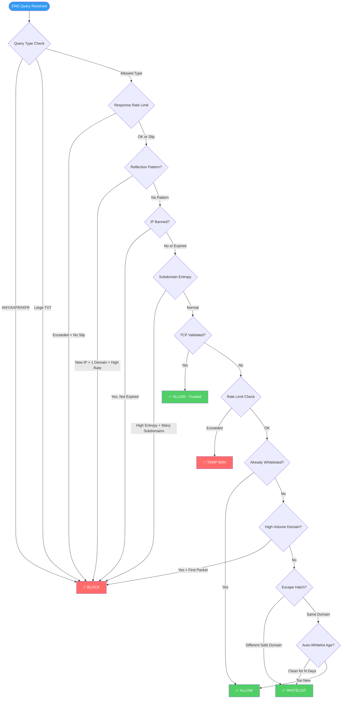

# nx53

[](https://github.com/hapara-fail/nx53/actions/workflows/ci.yml)

**High-Performance DNS Firewall & Amplification Mitigation Engine**

**nx53** is a lightweight, mission-critical firewall daemon written in **Rust**, optimized for Debian-based Linux environments. It operates as a protective layer for Public DNS Resolvers, specifically targeting the detection and mitigation of **DNS Amplification Attacks** (DDoS).

---

## 🛡️ Objective

The primary objective of nx53 is to protect open DNS resolvers from being exploited as amplifiers in DDoS attacks. It achieves this by:

- **Protocol Awareness:** Inspecting DNS traffic (Port 53 UDP/TCP) at wire speed.
- **Behavioral Analysis:** Identifying and blocking abusive traffic patterns without relying solely on static blacklists.
- **Kernel Integration:** Enforcing drop rules directly in the Linux kernel via Netfilter for minimal overhead.

---

## 🚀 Installation & Management

### Quick Install (Debian/Ubuntu)

The easiest way to install nx53 is to run the automated installer. This will download dependencies, compile the project, install the binary, set up the systemd service, and generate man pages and shell completions.

```bash
curl -s -S -L https://raw.githubusercontent.com/hapara-fail/nx53/main/install.sh | sh -s -- -v
```

Alternatively using `wget`:

```bash
wget --no-verbose -O - https://raw.githubusercontent.com/hapara-fail/nx53/main/install.sh | sh -s -- -v
```

During installation, you will be prompted to select a traffic profile (Home, School, Enterprise, Datacenter).

### Uninstallation

We provide a dedicated cleanup script to remove nx53 and all associated components (service, configs, man pages, completions).

```bash
curl -s -S -L https://raw.githubusercontent.com/hapara-fail/nx53/main/uninstall.sh | sudo sh
```

### Manual Build

If you prefer to build manually:

```bash
git clone https://github.com/hapara-fail/nx53.git
cd nx53
cargo build --release
sudo cp target/release/nx53 /usr/local/bin/
```

---

## ✨ Core Features

- **Heuristic Mitigation:** Uses a "First-Packet" rule and "Escape Hatch" logic to differentiate between legitimate users and attack scripts.
- **Zero-Cost Abstractions:** Built with Rust for memory safety and high throughput on minimal hardware.
- **Hybrid Operation:** Supports both automated intelligent filtering and manual static blocklists/whitelists.
- **Real-Time Telemetry:** Provides instant visibility into attack metrics and dropped IPs.

---

## 🔥 Advanced Protection Features

### Rate Limiting Per IP

Graduated response system to prevent abuse without blanket blocking:

| Offense | Action                       |
| :------ | :--------------------------- |
| First   | Temporary ban (default: 60s) |
| Repeat  | Longer ban (default: 300s)   |

Configure in `config.toml`:

```toml
[rate_limit]
enabled = true
requests_per_sec = 10
first_offense_duration_secs = 60
second_offense_duration_secs = 300
```

### DNS Query Type Filtering

Blocks query types commonly used in amplification attacks:

- **ANY queries:** Blocked by default (major amplification vector)
- **Large TXT queries:** Blocked when exceeding size threshold
- **Zone transfers (AXFR/IXFR):** Blocked by default (massive amplification)
- **Custom blocking:** Configure any query type to block

```toml
[filters]
block_any_queries = true
block_large_txt = true
txt_max_size = 1024
blocked_query_types = ["AXFR", "IXFR"]  # Configurable list
```

> **Note:** DNSSEC query types (RRSIG, DNSKEY) are allowed by default for proper DNSSEC validation.

### Response Rate Limiting (RRL)

Limits identical responses per second to prevent reflection attacks:

```toml
[filters]
enable_rrl = true
rrl_responses_per_sec = 5      # Max identical responses/sec
rrl_slip_ratio = 2             # Respond to 1/N requests when rate limited (0 = drop all)
```

### TCP Source Validation

IPs that complete a TCP handshake are proven non-spoofed and receive trusted status:

```toml
[filters]
tcp_validation_enabled = true
tcp_validation_ttl_hours = 24  # Trust duration after TCP validation
force_tcp_for_large = true     # Force TCP for responses > 512 bytes
max_udp_response_size = 512    # UDP response size limit (RFC 1035)
```

### Reflection Pattern Detection

Detects attack signatures: new IP + single domain + high rate = blocked immediately:

```toml
[filters]
detect_reflection_patterns = true
```

### Subdomain Entropy Detection

Detects random subdomain attacks (e.g., `abc123.example.com`, `xyz789.example.com`):

```toml
[filters]
subdomain_entropy_threshold = 3.5  # Shannon entropy threshold (0 = disabled)
```

### Amplification Ratio Limiting

Blocks IPs when response/query byte ratio exceeds threshold:

```toml
[filters]
amplification_ratio_limit = 10  # Block if response > 10x query size
```

> **Note:** This feature tracks query sizes from captured packets. For full amplification ratio enforcement, integrate with your DNS server to report response sizes via the `record_response_size` API.

### Automatic Whitelist Learning

IPs with clean traffic patterns are automatically whitelisted after a configurable period:

```toml
auto_whitelist_days = 7
```

### IPv6 Support

Full dual-stack monitoring with IPv6-specific attack pattern detection (enabled by default).

---

## 🧠 The Logic Engine

nx53 employs a **Dynamic Behavioral Inspection** engine to stop attacks without false positives.

### The Problem

DNS Amplification attacks involve spoofed IPs flooding a resolver with queries for a single, specific domain to generate large response packets.

### The Solution

nx53 uses a multi-stage **Defense Pipeline** to filter traffic:

1.  **Static Filtering:** Immediately drops specific query types (e.g., `ANY`, large `TXT`, `AXFR`) known for amplification.
2.  **Response Rate Limiting (RRL):** Caps identical responses per second with configurable slip ratio.
3.  **Reflection Pattern Detection:** Identifies attack signatures (new IP, single domain, high rate) in real-time.
4.  **Volumetric Analysis:** Continuously monitors domain confirmation levels to detect active attacks.
5.  **Rate Limiting:** Enforces strict queries-per-second limits on new or suspicious IPs, applying graduated temporary bans for offenders.
6.  **TCP Source Validation:** IPs proven via TCP handshake bypass reflection checks (can't spoof TCP).
7.  **Amplification Ratio Monitoring:** Blocks IPs when response/query ratio exceeds threshold.
8.  **Subdomain Entropy Detection:** Detects random subdomain attacks using Shannon entropy analysis.
9.  **The "First-Packet" Rule:** If a **new** IP's very first query is for a flagged "High-Volume" domain, it is immediately marked as hostile and blocked.
10. **The "Escape Hatch" (Legitimacy Validation):** If an IP queries a _different_ domain (one not under attack), it is re-classified as a legitimate user and whitelisted.
11. **Auto-Whitelisting:** IPs that maintain a clean reputation for N days (default: 7) are automatically trusted.

### Defense Pipeline Flowchart



---

## ⚙️ CLI Specification

The software is controlled via a standard Command Line Interface.

| Command        | Arguments                 | Description                                                                         |
| :------------- | :------------------------ | :---------------------------------------------------------------------------------- |
| `nx53 block`   | `<ip/domain>`             | Adds a static rule to drop all packets from an IP or specific domain queries.       |
| `nx53 allow`   | `<ip/domain>`             | Adds a static rule to whitelist an IP or domain (bypasses all checks).              |
| `nx53 toggle`  | `intelligent` \| `manual` | Toggles the active status of the heuristic engine or manual rulesets independently. |
| `nx53 stats`   | `[--json]`                | Displays real-time telemetry: attack counts, dropped IPs, and resource usage.       |
| `nx53 flush`   | `all` \| `banned`         | Clears nftables rules managed by nx53.                                              |
| `nx53 update`  | N/A                       | Updates nx53 to the latest version from GitHub.                                     |
| `nx53 version` | N/A                       | Displays the current version.                                                       |

---

## 💻 Tech Stack

- **Language:** [Rust](https://www.rust-lang.org/)
- **Packet Capture:** `pcap` / `af_packet`
- **Concurrency:** `Tokio` / `DashMap` for efficient state management.
- **Firewall:** `nftables` / Linux Netfilter

---

## ⚠️ Disclaimer

- **Root Privileges:** nx53 requires root access to manage network interfaces and firewall rules.
- **Compatibility:** Designed primarily for **Debian-based Linux** systems.
- **Use Responsibly:** This tool modifies kernel networking rules. Ensure you have out-of-band access to your server (e.g., VNC/Console) before deploying in production.

---

## 🤝 Contributing

Contributions are welcome! To ensure changes are processed quickly and correctly, please review our **[Contributing Guidelines](https://github.com/hapara-fail/nx53/blob/main/CONTRIBUTING.md)** before submitting.

If you have ideas for improvements, new tools, bug fixes, or blog post topics, please feel free to:

- **Open an Issue** on GitHub using our standardized templates.
- **Submit a Pull Request** with your proposed changes.
- Join our [Discord server](https://www.hapara.fail/discord) to discuss.

You can also find donation options [here](https://hapara.fail/contribute).

---

## 📄 License

This project is licensed under the terms specified at [www.hapara.fail/license](https://www.hapara.fail/license).
